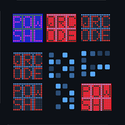
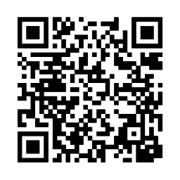
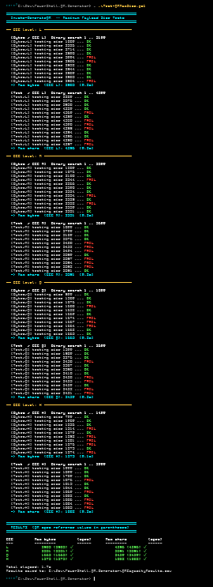

# Invoke-GenerateQR



---



---

A PowerShell Core (7+) function that generates QR code images from text strings or raw byte arrays and opens the result in the system image viewer.

---

## Requirements

- PowerShell 7.0 or later
- .NET SDK (`dotnet` CLI) — required on first run only to pull the [QRCoder](https://github.com/arsscriptum/PowerShell.QR.Generator) NuGet package
- Internet access on first run (NuGet restore); fully offline afterward

---

## Installation

Dot-source the script in your session or add it to your profile:

```powershell
. .\Invoke-GenerateQR.ps1
```

On first invocation the function downloads `QRCoder 1.6.0` via NuGet and caches the DLL to `$env:LOCALAPPDATA\PSQRCoder`. Every subsequent call loads directly from that cache — no network required.

If you prefer a fully offline install, drop `QRCoder.dll` (netstandard2.0 build) into `$env:LOCALAPPDATA\PSQRCoder\` manually and the auto-restore step is skipped.

---

## Syntax

```powershell
Invoke-GenerateQR -Text <string>
                  [-OutputPath <string>]
                  [-PixelsPerModule <int>]
                  [-ErrorCorrection <L|M|Q|H>]
                  [-NoDisplay]

Invoke-GenerateQR -Bytes <byte[]>
                  [-OutputPath <string>]
                  [-PixelsPerModule <int>]
                  [-ErrorCorrection <L|M|Q|H>]
                  [-NoDisplay]
```

---

## Parameters

| Parameter | Type | Default | Description |
|---|---|---|---|
| `-Text` | `string` | *(required)* | Unicode string to encode — URLs, vCards, mailto URIs, plain text, etc. |
| `-Bytes` | `byte[]` | *(required)* | Raw byte payload. Mutually exclusive with `-Text`. |
| `-OutputPath` | `string` | temp file | Full path for the output PNG. A random temp file is used when omitted. |
| `-PixelsPerModule` | `int` | `10` | Pixel size of each QR module (dot). Range: 1–50. |
| `-ErrorCorrection` | `string` | `M` | QR error correction level: `L` (7%), `M` (15%), `Q` (25%), `H` (30%). |
| `-NoDisplay` | `switch` | off | Skip launching the image viewer. The output path is still emitted to the pipeline. |

---

## Examples

### Text / vCard / mailto

```powershell
. .\Invoke-GenerateQR.ps1

$TestStr = @"
Guillaume Plante
mailto:planteg@proton.me
"@

Invoke-GenerateQR -Text $TestStr
```

### URL from byte array

```powershell
$url      = "https://www.test.com"
$encoding = [System.Text.Encoding]::UTF8
$ba       = New-Object byte[] ($encoding.GetByteCount($url))
$encoding.GetBytes($url, 0, $url.Length, $ba, 0)

Invoke-GenerateQR -Bytes $ba
```

### Custom size and error correction, save to a specific path

```powershell
Invoke-GenerateQR -Text "https://github.com" `
                  -PixelsPerModule 20 `
                  -ErrorCorrection H `
                  -OutputPath "C:\tmp\github_qr.png"
```

### Pipeline usage (no viewer)

```powershell
$path = Invoke-GenerateQR -Text "hello world" -NoDisplay
Write-Host "Saved to: $path"
```

---

## How it works

1. On first run, a throwaway `.csproj` is created in a temp directory and `dotnet restore` pulls `QRCoder 1.6.0` into `$env:LOCALAPPDATA\PSQRCoder`. The temp project is deleted immediately after.
2. `Add-Type` loads `QRCoder.dll`. The call is idempotent — .NET silently ignores duplicate loads.
3. `QRCodeGenerator.CreateQrCode()` builds the QR data matrix from the supplied text or byte array.
4. `PngByteQRCode.GetGraphic()` renders the matrix to a raw PNG byte array — no `System.Drawing` / GDI+ dependency, so it works on all PS7 platforms (Windows, macOS, Linux).
5. The PNG is written to disk and opened with the default system viewer (`Start-Process` on Windows, `open` on macOS, `xdg-open` / `feh` / `eog` on Linux).

---

## Platform notes

| Platform | Viewer used |
|---|---|
| Windows | `Start-Process <file>` (default PNG handler) |
| macOS | `open <file>` |
| Linux | first found among `eog`, `feh`, `display`, `xdg-open` |

If no viewer is found on Linux the function emits a warning and still writes the file.

---

## Tests Lengths

[](img/test.png)

```bash
ECC         Max bytes         (spec)   ok    Max chars         (spec)   ok
---         ---------         ------  ---    ---------         ------  ---
  L              2953         (2953)   ✓         4296         (4296)    ✓
  M              2331         (2331)   ✓         3391         (3391)    ✓
  Q              1663         (1663)   ✓         2420         (2420)    ✓
  H              1273         (1273)   ✓         1852         (1852)    ✓
 
```

---

## Author

Guillaume Plante

---

## License

MIT